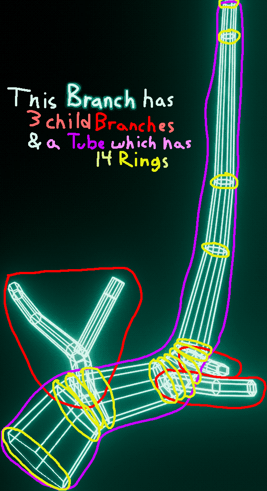
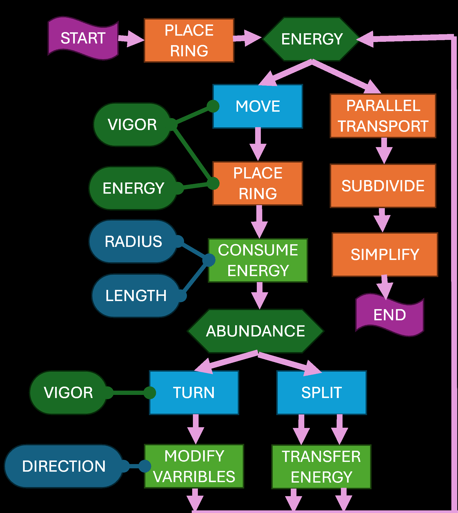

# Branch Generator
It generates 3d Branches as OBJ files!

## Requirements:
- Python 3.10.11
- numpy 2.0.0
- scipy 1.14.0

## How to use
Run `generate_branches.py`

It will generate 400 OBJ files and 400 JSON files

These will be placed into `output/??/??.obj` and `output/??/??.obj.json` where `??` is a number 0-19

The first `??` number are for different branches

The second `??` number are for different variation of the branch, where 0 often has spacing issues and 19 always has vigor issues.

## How to use the `Branch` Class
Here is some example code:
```py3
Branch.fromValue(
    value =     0.4,
    direction = Vec3(1,1,1),
    seed =      1
).writeEverything("output")
```
`Branch.fromValue( ... )` is an alternate constructor for `Branch` that makes generating branches easier.

`value` controls generating branches typically with spacing issues or typically with vigor issues. `0.4` means *typically* neither.

`direction` is a nonzero `Vec3` that points toward where the branch will *start* growing towards.

`seed` is for randomization purposes.

`.writeEverything( ... )` writes the branch to both an `.obj` file (3d model) and an `.obj.json` file (metadata)

## Alternate script
```py3
name = "output"
with open(f"{name}.obj", "w") as fp:
    obj = ObjWriter(fp, name, False)

    for x in range(20):
        for z in range(20):
            Branch.fromValue(
                value =     x/19,
                direction = Vec3.random(z),
                seed =      z + 1
            ).toObj(obj, Vec3(x, 0, z))
```
This script generates the same branches as `generate_branches.py`, however all the branches are placed into one OBJ file at different locations and no metadata is generated. Also, the branches are *not* triangulated (note the `False` in the `ObjWriter` constructor).

This is helpful for comparing multiple branches at once. Which is valuable for when
- tweaking the values in the `Branch` class
- manually determining for a given branch (seed) which value produces a branch with a given issue.

## High level of the classes:
This summary is only covers the parts of each class *essential* to understanding the function of the code. Some less-important details are skipped.
- `Branch` class has-a `Tube` and a list of child `Branch`es.
    - the constructor generates the `Tube` and constructs child `Branch`es
    - once the `Branch` is generated it does not get further modified
    - one notable method is `toObj` which takes an `ObjWriter` and recursively calls `writeTube` 
- `Tube` class has-a list of `Ring`s.
    - effectively a list of `Ring`s with some helper methods
    - The most important method is the `apply_parallel_transport` which modifies the `Ring`'s rotations to point towards each other
    - The methods `subdivide`, `simplify_angles`, and `simplify_distances` along with `apply_parallel_transport` are all helpful to make a `Tube` look pretty and minimize the `Ring` count (to reduce the tri-count after being meshed by `ObjWriter`).
        - The order I find works best is `simplify_distances` -> `apply_parallel_transport` -> `subdivide` (once or multiple times) -> `simplify_angles`
        - This is because `simplify_distances` can help prevent rare issues for `apply_parallel_transport`. `subdivide` increases computation time of later operations so is ideal to go later. `simplify_angles` needs to be last because it removes unnecessary `Rings` in an arbitrary way (so after `subdivide` which adds `Ring`s) and due to being arbitrary it would cause `apply_parallel_transport` to yield results less similar to source material.
- `Ring`s are positions (`Vec3`), `Rotation`s, and a radius (`float`)
    - They model circles in 3d space
    - The `Rotation` is optional - but most other methods and classes require the `Ring` to have a `Rotation`
- `Vec3` are an x y and z position (3 `floats`)
    - overrides math operators (`+`, `-`, `/`, `*`) for pair-wise operations
    - useful for doing $\mathbb{R}^3$ operations like `cross` and `dot`
    - `Rotation * Vec3` rotates the `Vec3` by the `Rotation`
- `Rotation`s are from `scipy` library
- `ObjWriter` uses a `TextIOWrapper` to write to a file.
    - has multiple methods to write to the `TextIOWrapper` - notably `writeTube` which writes a `Tube` to the `TextIOWrapper`
    - because of the way that OBJ files are structured it is recommended to have a single `ObjWriter` write the entire contents a given file



## How `Branch` generates `Tube`s
`Branch` generation follows a simple loop:

1. Place a `Ring` to the `Tube` of the `Branch`
2. Then place another `Ring` slightly ahead of the previous ring facing slightly more upward
3. Keep repeating

The radii of each new `Ring`, how far ahead each `Ring` is from the previous one, and how much it decides to turn are all determined by some variables: `Energy` and `Vigor`.

After each ring is placed  `Energy`, `Vigor`, and another variable `Abundance` are modified. (`Energy` is decreased based on the distanced between rings and the radii of the most recent ring. `Vigor` is based on the current direction it is facing. `Abundance` generally decreases towards 0)

Each branch starts with some `Energy`, but when it reaches 0, the branch stops generating.

When the branch stops, it then applies a beautification process to make the `Tube` more visually appealing. These process are described in more detail in the `Tube` class's high level overview.

One major exception to what was just described is that sometimes - the likelihood of which is determined by `Abundance` variable - instead of turning towards the sun and modifying the variables, the branch can 'split'.

During a split, the branch adds a new child `Branch` - which takes a randomized portion of the energy. The child branch have a `Vigor` and `Abundance` greater than the branch they split off of.

The parent branch's direction is modified and the child branch's direction are set such that they are perpendicular to each other and both are $45\degree$ to the original parent branch's direction.

Once as a child is constructed, it generates independently. Once generated - potentially creating new child `Branch`es of its own - and is beautified, then the parent continues generating again - independent of how the child generated after the split.

Here is a flow chart showing this general behavior.


## Branch Metadata
Exported to `name.obj.json` where `name.obj` is the 3d model when using `.writeEverything()` or the contents of the json file can be obtained from `branch.metadata` as a `dict`.

### Overview
```json
{
    "tube": [...],
    "bud_data": [...],
    "children": [...],
    "generation_settings": {
        "value": ...,
        "direction": {
            "x": ...,
            "y": ...,
            "z": ...
        },
        "seed": ...,
        "energy": ...
    }
}
```
`generation_settings` is simply the prams passed to `fromValue` (other than `direction` being normalized).

If the normal constructor for branch is used, `generation_settings` will not exist.

### The contents of `tube`
```json
"tube": [
    {
        "position": {
            "x": ...,
            "y": ...,
            "z": ...
        },
        "radius": ...,
        "rotation": {
            "w": ...,
            "x": ...,
            "y": ...,
            "z": ...
        },
        "length": 0.0
    },
    {
        "position": {...},
        "radius": ...,
        "rotation": {...},
        "length": ...
    },
    ...
]
```
There should always bet at least 2 elements.

Each element indicates a `Ring`.

`position` and `radius` are intuitive.

`rotation` is as a quaternion.

`length` is the total length of the tube from the begin of *that* tube *along* the tube *to this* ring. As such the first ring will always have a `length` of 0, and the last will have a `length` that is the length of the entire tube.

### The contents of `bud_counts`
Here is an example
```json
"bud_counts": [
        [0.11, 6],
        [0.25, 4],
        [0.33, 3],
        [0.77, 2],
        [1.01, 1]
]
```
This can tell you how many buds would be removed if the branch was pruned at a given location along its tube.

The example data indicates that being cut between:
- 0 to 0.11
    - 6 buds removed
- 0.11 to 0.25
    - 4 buds removed
- 0.25 to 0.33
    - 3 buds removed
- 0.33 to 0.77
    - 2 buds removed
- 0.77 to 1.01
    - 1 bud removed (the tip of this branch)
- the branch does not extend beyond 1.01 - so it can't be cut there - neither before 0.

This will always have at least one element which is `[total_length, 1]`

the contents of `bud_counts` can be entirely predicted from `children` and `tube[-1].length`. It exists because it might be handy to have this information in one place. 

In python calling `.metadata` on an instance of `Branch`, instead of `bud_counts` being an array of arrays it is a list of length 2 tuples.

### The contents of `children`
```json
"children":[
    {
        "tube": [...],
        "bud_counts": [...],
        "children": [...],
        "location": ...
    },
    ...
]
```
`children` can contain any number of elements each which represent another `Branch`.

They do not, however, contain `generation_settings` and instead have a `location`. `location` is a float which is how far along the *parent* branch this branch begins.

## ObjWriter
Writes vertices, faces, texture coordinates, vertex normals, and comments to an OBJ file.

Can optionally triangulate faces. If enabled, all non triangle faces will be exported as multiple triangle faces.

Can write arbitrary faces (if triangulation is enabled they should be convex), cubes, 'direction indicators', and most importantly `Tube`s.

Configure how the ends of the `Tube` is handled by using `EndConnectionMode` enum. (Note: CONNECTED is broken)

## Further documentation
All other files, classes, and methods are documented using *docstrings*. I am not going rewrite it all here.

The tube subdivision surface algorithm implemented in the `Tube` class is derived from the cullmark-clark subdivision. The derivation is in the file `subdivision surface of cylinders.txt`.